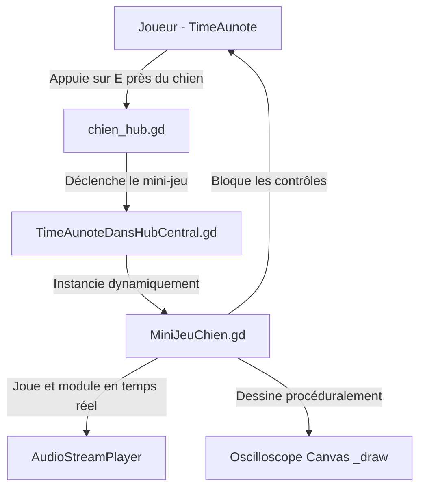

# Spécification Technique : Mini-Jeu d'Oscilloscope Audio avec le Chien (HUB Central)

Ce document décrit le design et l'architecture technique du mini-jeu récréatif de distorsion de fréquence avec le chien dans le HUB Central, implémenté sur la branche `feature/dog-game`.

---

## 🌌 Contexte et Objectifs

Remplacer l'interaction d'aboiement simpliste actuelle par un mini-jeu d'oscilloscope rétro interactif. Le mini-jeu doit être entièrement rejouable, axé sur la manipulation du sound design en temps réel (pitch et volume) et offrir une esthétique vectorielle cyberpunk soignée sans avoir recours à de nouveaux assets graphiques ou sonores.

### Caractéristiques principales :
- **Titre interne** : `MiniJeuChien` / `N.O.S.E` (Neural Oscilloscope Signal Extractor).
- **Zéro Assets Externe** : Dessin vectoriel 100% procédural (`_draw()`), utilisation exclusive des sons d'aboiements présents dans `res://audio/chien/`.
- **Rejouabilité** : Timer de vitesse d'alignement avec suivi du meilleur score de la session.
- **Modulation Sonore Dynamique** : Bruitages du chien modulés en hauteur (pitch) et volume (tremolo/saccades) selon les réglages physiques des sliders du joueur.

---

## 🛠️ Architecture Logicielle

Le système est découplé pour éviter la surcharge des scènes existantes et s'intégrer de manière fluide :



### 1. `MiniJeuChien.gd` (Hérite de `CanvasLayer`)
C'est la classe principale du mini-jeu. Elle s'occupe de :
- L'affichage de l'interface graphique (fond, oscilloscope, boutons, jauges).
- La boucle de génération d'ondes (onde cible vs onde du joueur).
- La capture des inputs clavier/souris (sliders).
- La gestion du lecteur audio et des modulations de pitch.
- L'émission du signal de fin pour rendre la main au joueur.

### 2. Intégration dans `TimeAunoteDansHubCentral.gd`
- Ajout d'une condition d'arrêt du déplacement dans `deplacement(delta)` :
  ```gdscript
  if not started or DialogueUI.is_dialogue_active() or (has_node("MiniJeuChien") and get_node("MiniJeuChien").is_active):
      timeAunote.animation(Vector2.ZERO)
      return
  ```
- Gestion du cycle de vie du mini-jeu dans `stop()` (suppression propre de l'instance si le joueur change d'époque en cours de route).

### 3. Ajustement de `chien_hub.gd`
Intercepter l'input d'interaction pour lancer le mini-jeu plutôt que de faire un aboiement standard :
```gdscript
if event.is_action_pressed("interagir"):
    var hub = get_parent()
    if hub and hub.has_method("lancer_mini_jeu_chien"):
        hub.lancer_mini_jeu_chien()
```

---

## 🎛️ Mécanique de l'Oscilloscope & Dessin Vectoriel

L'oscilloscope sera rendu dans un nœud `Control` personnalisé en redéfinissant sa fonction `_draw()` pour un rendu de lignes vectorielles rétro à 60fps.

### 1. Mathématiques des Ondes
Deux ondes sinusoïdales sont dessinées à l'écran :
1. **Onde Cible (Rouge)** : Représente la fréquence instable émise par le chien. Ses paramètres sont générés aléatoirement à chaque partie :
   - $A_{target} \in [20.0, 70.0]$ pixels.
   - $f_{target} \in [0.01, 0.05]$ radians/pixel.
2. **Onde Joueur (Cyan)** : Représente le signal de stabilisation. Ses propriétés sont contrôlées par les sliders :
   - $A_{player} = \text{Tension Slider} \in [10.0, 80.0]$
   - $f_{player} = \text{Fréquence Slider} \in [0.005, 0.06]$

À chaque frame, l'onde est dessinée en échantillonnant des points sur la largeur $W$ de l'écran de l'oscilloscope :
```gdscript
# Exemple de rendu dans _draw()
var points_target := PackedVector2Array()
var points_player := PackedVector2Array()
var time_offset := Time.get_ticks_msec() * 0.005 # Animation de défilement horizontal

for x in range(0, int(screen_width), 2):
    var y_target = sin(x * f_target + time_offset) * A_target + (screen_height / 2)
    var y_player = sin(x * f_player + time_offset) * A_player + (screen_height / 2)
    points_target.append(Vector2(x, y_target))
    points_player.append(Vector2(x, y_player))

draw_polyline(points_player, Color(0.24, 0.95, 0.79, 0.9), 2.5, true)
draw_polyline(points_target, Color(1.0, 0.2, 0.4, 0.7), 1.5, true)
```

---

## 🔊 Sound Design & Modulation Audio

Le sound design est le cœur du mini-jeu. Il utilise les fichiers d'aboiements du dossier `res://audio/chien/` :

1. **Rhythme de l'aboiement** : Un minuteur re-déclenche aléatoirement un des aboiements toutes les $0.7$ à $0.9$ secondes pour mimer un signal cyclique.
2. **Modulation de Pitch (Fréquence)** : Le pitch_scale du lecteur audio est directement lié au slider de Fréquence :
   - $\text{pitch\_scale} = \text{FrequencySliderValue} \in [0.5, 2.5]$
3. **Modulation de Distorsion / Volume (Tension)** : Si le signal du joueur est très éloigné de la cible, on applique des saccades (interruption rapide du volume via un LFO logiciel rapide) ou une réduction importante de gain pour mimer un signal brouillé. Plus on s'approche de la cible, plus le son redevient pur, rond et harmonieux.

---

## 🏆 Condition de Victoire & Rétroaction Visuelle

### Évaluation de la Similarité
À chaque frame, la distance mathématique entre le signal du joueur et la cible est évaluée :
$$\text{Erreur} = \frac{|f_{player} - f_{target}|}{\text{MaxFreq}} + \frac{|A_{player} - A_{target}|}{\text{MaxAmp}}$$

Si l'erreur est inférieure à un seuil critique (e.g. 5%) :
- L'oscilloscope affiche `✨ STABLE - ALIGNEMENT OK ✨` en vert fluo.
- La jauge de stabilisation progresse de $\text{delta} \times 0.67$ (il faut maintenir pendant 1.5s).
- Si l'utilisateur perd l'alignement, la jauge se vide lentement.

### Victoire !
Dès que la jauge de stabilisation atteint 100% :
- L'oscilloscope clignote en bleu électrique.
- Le chronomètre s'arrête et met à jour le `Session Best Time`.
- Une explosion de particules cyan (`CPUParticles2D`) est générée autour du chien dans le HUB.
- Le chien effectue un double aboiement joyeux à son pitch nominal.
- L'interface se referme gracieusement avec un fondu de transition.

---

## 🧪 Plan de Vérification

1. **Vérification de l'interface** : S'assurer que le CanvasLayer s'affiche correctement à la résolution `1024x682` sans déborder ou être étiré de manière anormale.
2. **Vérification des contrôles** : Confirmer que la souris peut cliquer et faire glisser les sliders, et que le clavier (touches directionnelles + ZQSD) permet d'ajuster précisément les valeurs.
3. **Vérification Audio** : Confirmer le bon chargement des fichiers audio et la modulation sans artefact (crépitement excessif) du pitch.
4. **Suspension de la Physique** : Vérifier que le joueur ne peut plus bouger ou interagir avec d'autres PNJ/portails pendant que l'interface est affichée.
5. **Résilience et sortie** : Confirmer que la touche `ÉCHAP` ou le bouton quitter referme proprement le jeu et restaure instantanément la liberté de mouvement de `TimeAunote`.
